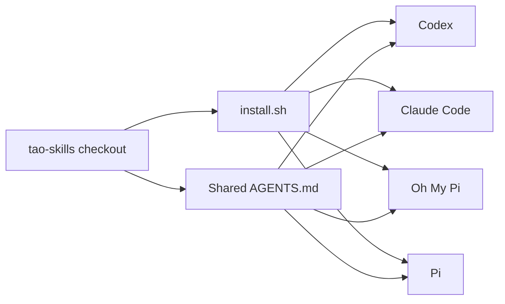

# Tao Skills

[](#skill-catalog)
[](#install)
[](#install)

> One skill collection. Four coding agents. One command to keep them aligned.

A curated collection of engineering, security, reasoning, and productivity skills for **Codex**, **Claude Code**, **Oh My Pi**, and **Pi**. Sources are managed through Git submodules and vendored forks, while local customizations stay in this repository.

## Why this collection

- **End-to-end engineering workflow:** move from ambiguity to a reviewed implementation with grilling, specs, tracer-bullet tickets, TDD, diagnosis, and two-axis code review.
- **Web3 security depth:** audit Solidity contracts and blockchain clients, investigate live exploits, then turn raw findings into report-ready issues.
- **Better decisions, not just more code:** domain modeling, deep-module design, architecture surveys, prototypes, research, and structured thinking improve the plan before implementation compounds mistakes.
- **One source of truth across agents:** the installer links every skill and the shared [`AGENTS.md`](./AGENTS.md) tool-use policy into all four supported agents.
- **Updates without copy drift:** installed entries are symlinks into this checkout. Pulling or updating the repository refreshes the agents without maintaining four copies.
- **Safe replacement:** existing instruction files and non-symlink skill directories are archived before managed links replace them.

## Skill catalog

The installer currently discovers **43 skills**. Every directory containing a `SKILL.md` is installed.

### Security and incident response

| Skill | What it is for |
| --- | --- |
| `contract-auditor` | Audit Solidity contracts for exploitable security issues. |
| `client-auditor` | Review blockchain nodes, execution clients, consensus clients, bridges, P2P code, and RPC surfaces. |
| `exploit-investigator` | Investigate an on-chain incident from a transaction hash and chain. |
| `finding-writer` | Convert one raw audit finding into a repository-grounded issue, recommendation, or note. |
| `finding-polisher` | Convert an audit finding in any structure into the standard report format without changing its confirmed meaning. |

### Engineering workflow

| Skill | What it is for |
| --- | --- |
| `ask-matt` | Route a task to the right skill or workflow. |
| `setup-matt-pocock-skills` | Configure tracker, triage labels, and domain-document layout for a repository. |
| `grill-with-docs` | Stress-test a design while building its glossary and ADRs. |
| `to-spec` | Convert the current conversation into a publishable specification. |
| `to-tickets` | Split a plan into dependency-aware tracer-bullet tickets. |
| `triage` | Classify and verify issues or external pull requests, then produce agent-ready briefs. |
| `wayfinder` | Plan work too large for one agent session as a map of decisions and tickets. |
| `implement` | Implement an agreed specification or ticket set. |
| `tdd` | Drive feature and bug work through red, green, and refactor. |
| `diagnosing-bugs` | Diagnose hard bugs and performance regressions with an evidence loop. |
| `prototype` | Build a disposable prototype to answer a design or UI question. |
| `research` | Investigate a question from primary sources and preserve cited findings. |
| `code-review` | Review changes independently against repository standards and the originating specification. |
| `resolving-merge-conflicts` | Resolve merge or rebase conflicts by tracing both sides' intent. |
| `codebase-design` | Design deep modules with small interfaces and clean seams. |
| `domain-modeling` | Sharpen project terminology, context documents, and architectural decisions. |
| `improve-codebase-architecture` | Find deepening opportunities and present them in a visual architecture report. |
| `wizard` | Generate an interactive shell wizard for human-only infrastructure or migration steps. |

### Thinking and productivity

| Skill | What it is for |
| --- | --- |
| `thinking-partner` | Challenge assumptions and apply the smallest useful mental model. |
| `grill-me` | Relentlessly question a plan until its decision branches are explicit. |
| `grilling` | Reusable stress-testing primitive behind several planning workflows. |
| `to-questionnaire` | Turn unresolved decisions into a questionnaire for the person who owns them. |
| `handoff` | Compact an active conversation into a grounded handoff for another agent. |
| `teach` | Run a stateful, multi-session learning workflow in the current workspace. |
| `wait-what` | Re-pitch an explanation that did not land, with less noise and better context. |
| `writing-for-agents` | Write and prune skills, `AGENTS.md`, `CLAUDE.md`, and other agent-facing documents. |

### Focused utilities

| Skill | What it is for |
| --- | --- |
| `git-guardrails-claude-code` | Install Claude Code hooks that block destructive Git commands. |
| `setup-pre-commit` | Configure Husky, lint-staged, formatting, type checking, and tests. |
| `migrate-to-shoehorn` | Replace unsafe test assertions with `@total-typescript/shoehorn`. |
| `scaffold-exercises` | Create course exercise structures with problems, solutions, and explainers. |

### Experimental

These are installed but remain upstream works in progress:

`claude-handoff` · `implement-spec` · `loop-me` · `retro` · `setup-ts-deep-modules` · `writing-beats` · `writing-fragments` · `writing-shape`

## Install

### 1. Clone

```sh
git clone --recurse-submodules git@github.com:sasiyaluba/skills.git
cd skills
```

HTTPS also works:

```sh
git clone --recurse-submodules https://github.com/sasiyaluba/skills.git
cd skills
```

### 2. Run the installer

```sh
./install.sh
```

The script:

1. Initializes and updates skill submodules.
2. Discovers every `SKILL.md` and rejects duplicate skill names.
3. Detects installed agents from their executable or configuration directory.
4. Links the skills into each detected agent.
5. Links this repository's [`AGENTS.md`](./AGENTS.md) as each agent's user-level instructions.
6. Archives conflicting instruction files and non-symlink skill directories under `~/.local/share/sasiyaluba-skills-backups/`.



### Installed locations

| Agent | Skills | Shared instructions |
| --- | --- | --- |
| Codex | `~/.codex/skills/` | `~/.codex/AGENTS.md` |
| Claude Code | `~/.claude/skills/` | `~/.claude/CLAUDE.md` |
| OMP | `~/.omp/agent/skills/` | `~/.omp/agent/AGENTS.md` |
| Pi | `~/.pi/agent/skills/` | `~/.pi/agent/AGENTS.md` |

All instruction paths point to the same repository file. Claude Code receives it through `CLAUDE.md`, the filename it loads natively.

If submodules are already synchronized and only the links need refreshing:

```sh
TAO_SKILLS_SKIP_SUBMODULE_UPDATE=1 ./install.sh
```

## Update

```sh
./update.sh
```

`update.sh` pulls the main repository when an upstream branch is configured, updates all skill submodules, merges `DarkNavySecurity/web3-skills` into the customized `sasiyaluba/web3-skills` fork, refreshes the three vendored Web3 skills, and runs the installer again.

If the Web3 fork is behind upstream, the script merges and pushes the updated fork. A merge conflict stops the update and preserves the temporary checkout for manual resolution.

## Sources

- [`mattpocock/skills`](https://github.com/mattpocock/skills): engineering and productivity workflows.
- [`DarkNavySecurity/web3-skills`](https://github.com/DarkNavySecurity/web3-skills): Web3 auditing and exploit investigation, maintained here through a customized fork.
- [`sasiyaluba/thinking-partner`](https://github.com/sasiyaluba/thinking-partner): structured decision support and mental models.
- Local additions: `finding-writer`, `finding-polisher`, shared agent instructions, installation, and update automation.
